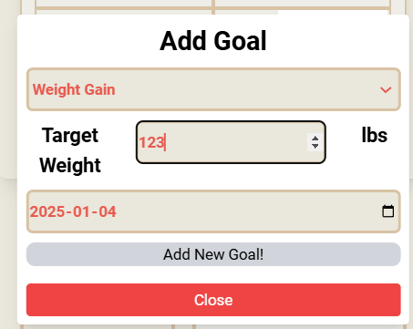
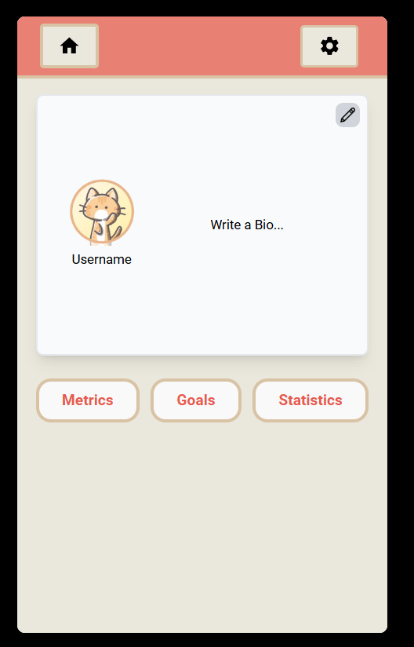

# Concept Fitness Overview

The following application is a prototype fitness application that provides a complete front end but not backend. The following readme offers information on how to access the website as well as a high level overview of how to interact with the system.

#### Developers
- Joshua Walters
- Nicholas Lam
- Raisa Rafi
- Fairooz Haque

## How to Access

### Deployed Website
Concept Fitness is deployed at the following address.\
**Website Address**: https://conceptfitness.onrender.com

### Development 

1. clone repo
2. npm install
3. npm run dev to run application on local host

## How to Use the System

### Best Way to View the Application
The application is technically a web application designed in a way to simulate a mobile one through sizing of the view. While the device can be viewed in the normal web browser view it can create weird formatting if the screen is large. Ideally, it is best to open the app in the dev tools and use a mobile device such as the Iphone 14. This can be done through inspect element and then changing the device to a phone model. Also please note sometimes the dev tools will not open the phone view properly, toggling between the phone view and responsive should fix this.
### High level Overview
The application is meant to be a touch application as it is mobile although mouse can control some aspects anyways allowing it to be used for convenience while testing. 

As for data persistence most functionality in the app works unless otherwise specified but will not save between instances of the website. For example adding a program will reflect in all pages but reloading will return the website to the default state.

## Application Navigation

### Login Page
When first accessing the website the user will be greeted by a login screen.
\
The user can either sign up or login. There are checks to ensure that a valid email address is entered but since this is a prototype there is no validation on what password or email is entered.

### Sign up Page
If the user does not have an account and wishes to create one, they can go to the sign up page
\
Similar to the login page, there are checks to ensure that a valid email address is entered but since this is a prototype there is no validation on what password or email is entered. There are also checks to ensure that the "Password" field matches the "Confirm Password" field.

### Home Page
After successful credential validation the user will be brought to the following homepage
\
The homepage presents the user with several components. Theses are a calendar, buttons to navigate to some of the key pages, exercises, programs and logs as well as a goals tab and the ability to start a workout session. There is also a a navbar that is present on all pages. The profile button allows the user to navigate to the profile page or logout. A home buttons also appears on all other pages' instances of the navbar.\
\
The calendar shows the current week centered on the current day. It can be scrolled through to view each day of the week and on the top there are arrows to scroll through multiple weeks. Each day of the calendar has a hamburger menu that can be clicked to reveal some options for that day.\
The user can add a program to schedule it for that day from their existing programs, add multiple goals to that day or remove a goal. When adding a program a popup will appear giving the user options they can schedule from. \
 \
When adding a goal the user can select the goal type as well as optionally attach it to an exercise as demonstrated in the below images. \
\
 \
Below we will outline each of the key pages of the application.

### Exercises Page

The exercises page shows a list of all the exercise in the system. For the purpose of this prototype we have a small selection the user can browse through. There also a search bar that can search exercises via name, muscle group or equipment.\
\

 Each exercise in the list displays those key details that can be searched and doubles as a dropdown. When clicked the exercise will expand to show more details which are hardcoded. \
 \

The page also doubles as a Program creation window. The system will assume a program is currently in creation. If the user presses the add button on an exercise it will be added to the program. Currently edited program details can be seen in the sliding drawer on the right. \
 \
Here the user can edit the program name, add tags to it as well as remove exercises and add them to other programs through the add buttons here. There is also a book icon that navigates the user to the Programs page. If the user ever navigates away from the page with exercises in the cart the program will be saved. If there is no name it will be saved under the name "My program #x".

### Program Page

The Program page shows a list of the users currently created workouts. Programs can be searched via name, tag, and exercises. For each program the user can press the play icon to start it which will navigate the user to the Session page. The edit button to be navigated to the exercises page where they can make changes and finally the option to delete a program. There is also a button to add a program next to the search bar which will navigate the user to the Exercises page for the creation. \
 \
In addition each Program can be expanded to show the exercises it contains. Exercises can be removed or added to other programs from here \
 \

### Session Page

The Session page can be navigated to in a variety of ways. If the Start session button is clicked from the homepage the user will be navigated to the page directly if there is a program scheduled for that day otherwise they will be brought to the programs page where they can select a program to perform which will bring them to Session page below. \
 \
The top buttons control the timer and the session. The user can optionally start a timer to record the duration of their session which will be saved along with all other session data when finish session is clicked. \

Below is the exercise relevant data. There are boxes to enter the current weight and reps for the current exercise as well as to save a set. Below these inputs the current exercise and set are listed along with a description of the exercise paired with an instructional video. There are also arrows next to the exercise title so the user can scroll through the exercises in the session. 

If the user needs to go back and edit a set or wants to perform exercises in a different order they can open the sliding drawer. \
 \
This gives the user the ability to select and exercise they want to do a set for with the play button. If they want to edit or delete a set they can open the dropdown for the exercise and click the corresponding icon. Note the dropdown only appears if there are sets recorded. \
 \
If the user edits an exercise set that sets data will be put into the main window and once the set is saved it will increment to that exercise's current set.\

Finally, when a session is finished the user is asked to confirm their choice in which case all data will be saved in the form of a Session log. Any all time records for exercises will be saved to an Exercise log.

### Logs Page

The logs page has 2 main sections the Session logs and the Exercise Logs \
 \

First looking at Session logs which is pictured above the user can search a log via program name, contained exercise or date. With no date inputted a list of all logs will be presented. The log is a dropdown which shows the program name, date and duration by default. When expanded the user can see a list of all exercises and sets performed in that session. They also have the ability to add that exercise to another program. \
 \

The Exercise logs tab provides a log of all time data on all exercises that the user has done. They can search exercises via name and equipment. Each exercise in the list is a drop down which shows the name and equipment for the exercise in addition to having a button for adding the exercise to another program. \
 \
Once expanded the user can see their max reps, sets and weight for the exercise. In addition there is a graph of progress on the exercise that can be scrolled through in weekly increments. Note that the graph is hardcoded for 31 data points and the date input below it does not actually search the date on the graph.
 \

### Profile Page

The profile page provides the user with the ability to edit their profile. The top provides customization elements for their username and a short bio while the lower section lets them see a display of metrics, goals and statistics. The profile picture cannot be edited. \
 \
 \
Metrics are all the key user details. Here they can edit data such as their age, weight, height and activity level. If there were a backend, these pieces of information would be used in the goal system.
\
 \
The goals tab lets the user defined high level goals related to weight. They can set their goal to gain, lose or maintain weight. For now, there are no validation checks for inconsistent inputs. For example, if the user sets their goal to "lose weight" and then sets their target weight to be greater than their current weight, the form would still save. This is included in the portfolio as an improvement that can be implemented.  \
 \
 \
The statistics tab shows a graph related to the user's high level weight goal to show their progress over time. The data points in the graph are hard coded and are not linked to any kind of information that the user logs. Our goal was to make other types of graphs like weekly averages over a month and then allow users to switch between them, but it could not be done due to time constraints. \
 \
Finally, there is a settings button that creates a popup that allows the user to change their unit preferences between metric and imperial. Please note that persistence through the whole website has not yet been implemented. \
 \

